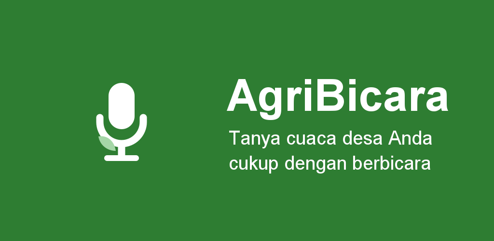
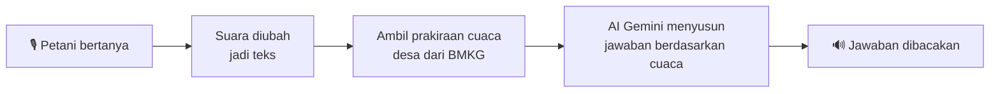
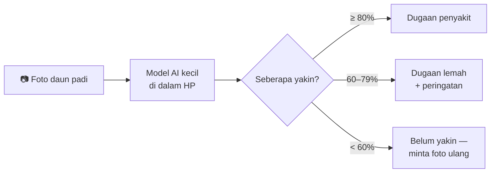

# AgriBicara

[](https://github.com/if7D0/agribicara/actions/workflows/ci.yml)
[](LICENSE)


**Asisten pertanian di HP yang bisa diajak bicara.** Petani cukup menekan tombol
mikrofon, bertanya dalam Bahasa Indonesia, lalu mendengar jawabannya dan bisa
memotret daun padi untuk mengetahui kemungkinan penyakitnya, bahkan tanpa internet.



---

## Apa ini?

Banyak petani kecil di Indonesia menggarap lahan kurang dari 2 hektare dan tidak
terbiasa membaca aplikasi yang penuh menu dan tulisan. Padahal keputusan harian
mereka seperti kapan menanam, kapan menyemprot, apakah besok hujan, sangat bergantung
pada informasi cuaca.

AgriBicara mencoba menjawab masalah itu dengan dua kemampuan:

| | Kemampuan | Butuh internet? |
|---|---|---|
| 🎙️ | **Tanya-jawab lewat suara.** Tanyakan misalnya *"Besok cocok untuk menanam tidak?"*. Aplikasi melihat prakiraan cuaca untuk desa Anda, lalu menjawab dengan suara dalam kalimat sederhana. Bisa juga mengetik bila sedang tidak bisa bersuara. | Ya |
| 🌾 | **Cek penyakit padi dari foto.** Foto satu helai daun padi dari dekat; aplikasi menyebut dugaan penyakitnya beserta seberapa yakin ia. | **Tidak** — berjalan penuh di HP |

Ditambah: prakiraan cuaca per desa, pemberitahuan bila diperkirakan hujan lebat,
tulisan besar dan kontras tinggi agar mudah dibaca di bawah terik matahari, serta
mode gelap.

## Cara kerjanya

**Tanya-jawab suara**



Jawaban AI selalu dilandaskan pada data cuaca desa yang dipilih, bukan tebakan
umum. Bila layanan BMKG sedang tidak bisa dihubungi, aplikasi beralih ke
Open-Meteo sebagai cadangan.

**Cek penyakit padi**



Aplikasi sengaja membedakan dugaan kuat dari dugaan lemah. Menurut data uji,
dugaan di atas 80% hampir selalu benar, sedangkan dugaan 60–79% hanya benar
sekitar dua dari tiga kali — jadi petani perlu tahu bedanya sebelum membeli obat.

<details>
<summary><b>Istilah yang dipakai di halaman ini</b></summary>

- **APK** — berkas pemasang aplikasi Android.
- **Offline** — bekerja tanpa koneksi internet.
- **STT / TTS** — *speech-to-text* (suara → teks) dan *text-to-speech* (teks → suara).
  Keduanya memakai mesin bawaan Android.
- **Model / TFLite** — "otak" pengenal gambar yang sudah dilatih, disimpan di
  dalam aplikasi dan dijalankan langsung oleh HP.
- **BMKG** — Badan Meteorologi, Klimatologi, dan Geofisika, sumber prakiraan cuaca resmi.
- **App Check** — penjaga dari Firebase yang memastikan hanya aplikasi resmi yang
  boleh memakai layanan AI.

</details>

## Status proyek

**Selesai sebagai proyek portfolio** (September 2026).

- ✅ Aplikasi berfungsi dan sudah dipakai di perangkat Android sungguhan.
- ✅ 308 unit test, cakupan baris kode 90,3%, dan pemeriksaan otomatis (CI) di
  setiap perubahan.
- ❌ **Tidak diterbitkan di Play Store** dan **belum pernah dipakai petani
  sungguhan.** Keputusan ini disengaja: yang tersisa dari jalur rilis adalah urusan
  akun, masa uji tertutup, dan rekrutmen lapangan — bukan lagi soal kode.

## Mencoba sendiri

Aplikasi ini dibangun dari kode sumber dengan Android Studio. Langkah lengkapnya
ada di **[Panduan Pengembang](docs/DEVELOPMENT.md)**. Setelah `git clone` dan build,
yang langsung bisa dipakai tanpa pengaturan tambahan:

- ✅ **Cek penyakit padi** — berfungsi penuh dan offline.
- ✅ Prakiraan cuaca, pemilihan desa, pemberitahuan, dan seluruh tampilan.
- ❌ **Tanya-jawab suara** — menampilkan *"Layanan jawaban sedang tidak bisa dihubungi."*

Yang terakhir bukan kerusakan. Proyek ini **tidak menyimpan kunci API di dalam
aplikasi**, karena kunci seperti itu bisa dibongkar siapa saja. Sebagai gantinya,
layanan AI hanya menerima permintaan dari aplikasi yang ditandatangani pemilik
proyek. Untuk menghidupkannya di salinan Anda, buat projek Firebase sendiri —
caranya di [Panduan Pengembang](docs/DEVELOPMENT.md#menghidupkan-fitur-ai-di-clone-anda).

## Keterbatasan yang jujur

Hal-hal berikut **belum terbukti** dan sengaja dicatat terbuka:

- **Akurasi 86,2% diukur pada data uji, bukan di sawah.** Foto daun blas yang
  jelas terlihat pun hanya mendapat keyakinan 64% — kondisi lapangan lebih sulit
  daripada dataset.
- Belum pernah diuji dengan logat daerah; semua uji suara memakai satu penutur.
- Belum diuji di HP kelas bawah (Android 7, RAM 2 GB) maupun dengan pembaca layar TalkBack.
- Pengambilan foto langsung dari kamera belum diuji; semua uji lewat galeri.
- Pemberitahuan cuaca ekstrem belum pernah terlihat di layar, karena selama
  pengembangan BMKG tidak pernah meramalkan hujan ≥50 mm.
- Hipotesis utamanya — bahwa petani lebih suka berbicara daripada membaca —
  belum divalidasi dengan pengguna sungguhan.

## Untuk developer

**Teknologi:** Kotlin · Jetpack Compose · Hilt · Room · Retrofit + OkHttp ·
kotlinx.serialization · WorkManager · DataStore · Coil · Timber · TensorFlow Lite ·
Firebase (AI Logic, App Check, Crashlytics)

**Arsitektur:** Clean Architecture dalam satu modul `:app`, paket `com.agribicara.app`:

```
core/          common, util
di/            modul Hilt
data/          ai, appcheck, local{dao,entity,migration}, logging, mapper, ml,
               notification, remote{bmkg,openmeteo,wilayah}, repository, speech, worker
domain/        ai, ml, model, repository, usecase, weather
presentation/  detection, home, license, navigation, onboarding, region, theme,
               voice, weather
```

**Model penyakit padi:** MobileNetV3-Small, 10 kelas (9 penyakit dan hama padi,
plus daun sehat), dilatih dengan dataset Paddy Doctor. Kode pelatihannya ada di
[`ml/`](ml/).

| Dokumen | Isi |
|---|---|
| [Panduan Pengembang](docs/DEVELOPMENT.md) | Syarat build, setup, perintah, test, build rilis, catatan versi |
| [`ml/README.md`](ml/README.md) | Pelatihan dan konversi model |
| [`docs/play/release-checklist.md`](docs/play/release-checklist.md) | Jalur rilis Play Store yang tidak ditempuh, terdokumentasi utuh |
| [`docs/legal/privacy-policy.md`](docs/legal/privacy-policy.md) | Kebijakan privasi |

## Kredit

- **Dataset Paddy Doctor** — Petchiammal A, Briskline Kiruba S, D. Murugan,
  Pandarasamy Arjunan. [paddydoc.github.io](https://paddydoc.github.io), lisensi
  Apache-2.0. Atribusi lengkap di [`ml/NOTICE`](ml/NOTICE).
- **Prakiraan cuaca** — [BMKG](https://www.bmkg.go.id), dengan
  [Open-Meteo](https://open-meteo.com) sebagai cadangan.
- **Daftar wilayah** — [wilayah.id](https://wilayah.id).

## Lisensi

Kode sumber dirilis di bawah [Apache License 2.0](LICENSE).
